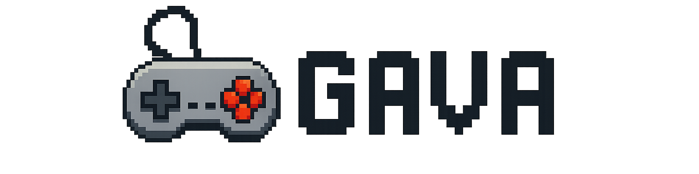

<h1 align="center">
  <picture>
    <source media="(prefers-color-scheme: dark)" srcset="assets/GavaWhite.png">
    <source media="(prefers-color-scheme: light)" srcset="assets/GavaBlack.png">
    
  </picture>
  &nbsp;
</h1>

Gava is a lightweight, flexible, and easy-to-use gaming library for Java. Designed for 2D game development, it provides tools for graphics, input handling, game loops, and more.

---

## Getting Started

Create your first window, render sprites, and handle input with this minimal example:

```java
import java.awt.Graphics;

import org.gava.*;

public class DemoGame extends Game {
    @Override
    public void update() {}

    @Override
    public void draw(Graphics g) {
        g.fillRect(100, 100, 100, 100);
    }

    public static void main(String[] args) {
        new DemoGame().run();
    }
}
```
